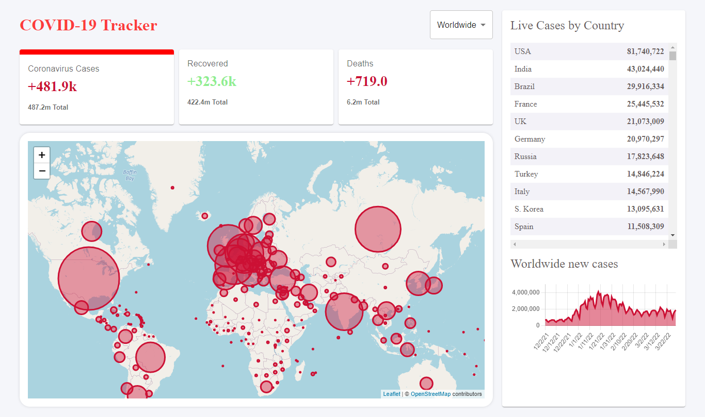

<h1 align="center">Covid 19 Tracker</h1>

<div align="center">
  <h3>
    <a href="https://covid-19-tracker-7b7422.netlify.app/">
      Live
    </a>
    <span> | </span>
    <a href="https://github.com/sayyedulawwab/covid-19-tracker">
      Code
    </a>
    
  </h3>
</div>

It is a mini project done while learning React.



<details open>
  <summary>Table of Contents</summary>
  <ul>
    <li><a href="#built-with">Built With</a></li>
    <li><a href="#installation">Installation and Usage</a></li>
    <li><a href="#contact">Contact</a></li>
  </ul>
</details>

### Built With

- [React](https://reactjs.org/)
- [disease.sh - Open Disease Data API](https://disease.sh/)
- Deployed using [Netlify](https://www.netlify.com/)

### Installation and Usage

To clone and run this application, you'll need [Git](https://git-scm.com) and [Node.js](https://nodejs.org/en/download/) (which comes with [npm](http://npmjs.com)) installed on your computer. From your command line:

1. Clone this repository

```bash
$ git clone https://github.com/sayyedulawwab/covid-19-tracker.git
```

2. Install dependencies

```bash
$ npm install
```

3. Set the api key in .env file like .env.example file

4. Run the app

```bash
$ npm start
```

## Contact

- Twitter: [@sayyedulawwab](https://twitter.com/sayyedulawwab)
- LinkedIn [@sayyedulawwab](https://www.linkedin.com/in/sayyedulawwab/)
